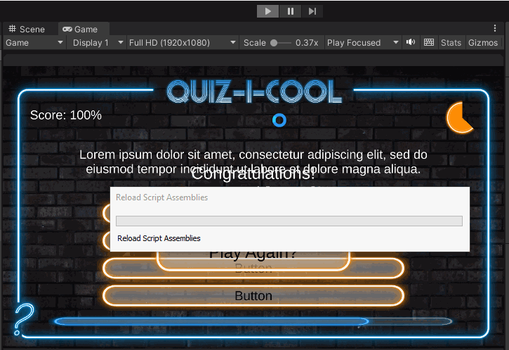

# Quiz-game_Unity

A simple quiz game where I learn:

<ul>
<li>UI on Canvas</li>
<li>Text Mesh Pro</li>
<li>Layout</li>
<li>Scriptable Object</li>
<li>Button, Slider state</li>
<li>Timer</li>
</ul>

<!-- Thanks to Udemy course of GameDev.tv -->
